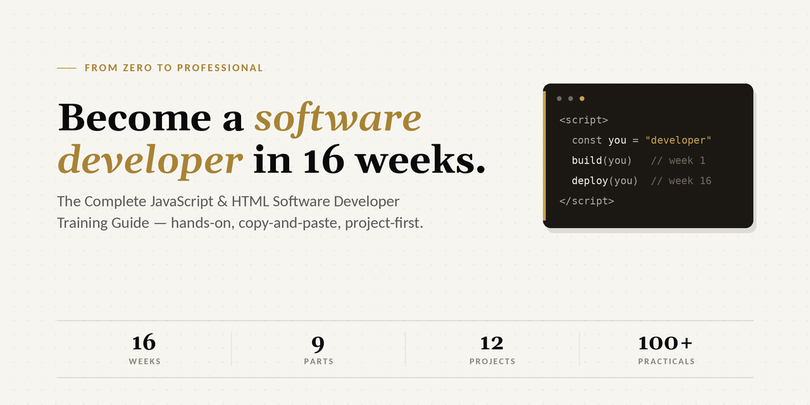

# The Complete JavaScript & HTML Developer Training Guide

**From zero to professional in 16 weeks.** A step-by-step, hands-on curriculum with copy-and-paste practicals, real-world projects, and cross-language integration — no prior experience required.

**Live site:** [seyidev-ops.github.io/softwaredeveloper](https://seyidev-ops.github.io/softwaredeveloper/)

## What's inside

| Part | Weeks | Focus | Milestone |
|---|---|---|---|
| 0 | Start here | How the guide works + workstation setup | Workstation ready |
| 1 | 1–2 | HTML | Personal profile page |
| 2 | 2–3 | CSS | Styled, mobile-friendly site |
| 3 | 3–6 | JavaScript Core | Guessing game + expense tracker |
| 4 | 6–8 | The DOM | To-Do app + calculator |
| 5 | 8–10 | Modern & Async JS | Live weather app |
| 6 | 10–12 | Node.js Backend | Remote Job Board API |
| 7 | 12–14 | Databases + Capstone | Full-stack Remote Job Board |
| 8 | 14–15 | Cross-Language Integration | Polyglot dashboard |
| 9 | 15–16 | Professional Practice | Live portfolio, deployed apps |

**9 parts · 12 real projects · 100+ copy-and-paste practicals.** A Word edition of the full guide is available in [`assets/`](assets/).

---

An **Everything*RemoteJob*** training product.
